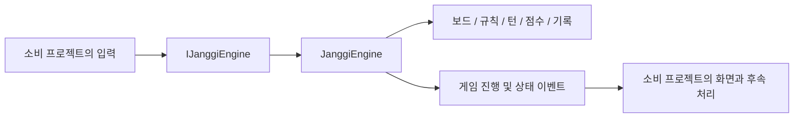
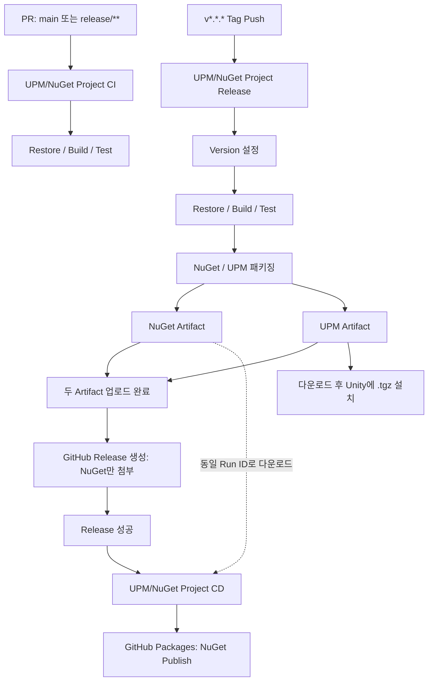

# YuJanggi.Engine

Unity에 의존하지 않는 C# 장기 규칙 및 게임 진행 라이브러리입니다. 기물 이동, 합법성 판정, 턴·시간·점수·수 기록을 게임 화면과 분리하고, 동일 소스를 NuGet과 Unity UPM 패키지로 제공합니다.

- **규칙과 화면 분리**: 보드 상태와 게임 진행을 엔진에서 처리하고 이벤트로 결과 전달
- **이동 검증**: 기물별 이동 후보·궁성 규칙·이동 후 자신의 왕이 장군인지 확인하는 단계 분리
- **CI/CD**: PR 검증, Tag 기반 NuGet / UPM 패키징, 검증한 NuGet Artifact의 GitHub Packages Publish

## 역할과 전체 구조

Engine은 장기판과 규칙을 담당하고, 소비 프로젝트가 입력·화면·네트워크를 연결합니다. Unity API나 Protocol 메시지를 엔진 내부에서 사용하지 않습니다.



핵심 기술은 C# 9, .NET 10 / .NET Standard 2.1, UPM, MSTest, GitHub Actions입니다.

## 주요 구조와 기능

| 구성 요소 | 역할 |
| --- | --- |
| [`JanggiEngineFactory` / `IJanggiEngine`](src/JanggiEngine) | 옵션 기반 생성과 게임 진행·조회·이벤트 구독 API |
| [`JanggiBoard`](src/JanggiBoard/JanggiBoard.cs) | 기물 배치, 이동·포획, 이동 복원 |
| [`JanggiRule`](src/JanggiRule/JanggiRule.cs) | 기물별 이동 후보, 궁성 이동, 합법성 및 장군 판정 |
| [`JanggiTurn`](src/JanggiTurn/JanggiTurn.cs) | 현재 차례, 제한시간, 턴 전환과 종료 상태 |
| [`JanggiScore`](src/JanggiScore/JanggiScore.cs) | 포획에 따른 점수 변경과 복원 |
| [`JanggiRecord`](src/JanggiRecord/JanggiRecord.cs) | 이동·한 수 쉼 기록, 기록 조회와 리플레이 기록 모드 |

`JanggiOptions`로 초·한 포진, 턴 제한시간, 보드 크기 등을 전달합니다. `InitEngine()`이 기물을 배치하고 `StartEngine()`이 기록·점수·초의 첫 차례를 초기화합니다.

대표 기능은 다음과 같습니다.

- 기물별 이동 가능 위치와 불법 이동 위치 조회
- 현재 차례·좌표·기물·이동 합법성 검사 후 이동 적용
- 이동·포획에 따른 기록, 점수, 턴 변경
- 무르기, 한 수 쉼, 기권과 합법적인 다음 수가 없는 경우의 종료 처리
- 이동·장군·게임 종료 및 시간·기록·점수 이벤트
- 별도 보드 복사본에서 합법 수 조회와 이동·복원을 제공하는 `IAIPosition`

`IAIPosition`은 탐색에 사용할 상태 API이며, AI 탐색 알고리즘 자체를 구현하지는 않습니다. 리플레이도 기록 모드와 조회 API를 제공하며, 재생 화면과 진행 제어는 소비 프로젝트에서 구성합니다.

## 이동 처리

```text
TryMove(from, to)
→ 종료 상태 / 좌표 / 기물 / 현재 차례 확인
→ 기물별 이동 및 궁성 규칙으로 후보 생성
→ 후보 이동을 적용하고 자신의 왕이 장군인지 확인한 뒤 보드 복원
→ 합법적인 이동 적용
→ 점수·기록 갱신 및 이동 이벤트
→ 상대의 합법 수 존재 여부에 따라 종료 또는 턴 전환
```

[`CandidatePipeline`](src/JanggiRule/CandidatePipeline.cs)은 이동 후보를 만들고, [`LegalMoveStep`](src/JanggiRule/Steps/LegalMoveStep.cs)은 후보별 이동을 임시 적용해 자신의 왕을 보호하는지 검사합니다. 임시 이동은 `finally`에서 복원합니다. 규칙 계산은 인스턴스 내부 작업 메모리를 재사용하므로 같은 인스턴스를 동시에 호출하지 않는 방식으로 사용합니다.

## 사용 방법

공개 진입점은 `JanggiEngineFactory.CreateEngine`이 반환하는 `IJanggiEngine`입니다.

```csharp
using YuJanggi.Engine.JanggiEngine;
using YuJanggi.Engine.JanggiOption;

var options = new JanggiOptions
{
    TurnTime = 30f
};

IJanggiEngine engine = JanggiEngineFactory.CreateEngine(options);
engine.BindEvents();
engine.InitEngine();
engine.StartEngine();
```

소비 프로젝트에서 `GameEvents` / `GameStateEvents`를 구독하고, 이동 입력은 `TryMove`로 전달합니다. 시간 진행은 `Tick(deltaTime)`으로 갱신하고, 엔진 사용을 마칠 때 `UnBindEvents()`로 내부 이벤트 연결을 해제합니다. 소비 프로젝트가 등록한 구독도 해당 프로젝트에서 해제합니다.

## 패키지 구성

| 패키지 | 구성 | 제공 위치 |
| --- | --- | --- |
| NuGet `YuJanggi.Engine` | `net10.0` / `netstandard2.1` 라이브러리 | GitHub Packages, GitHub Release, Actions Artifact |
| UPM `com.seokjinyoo.yujanggi.engine` | `package.json`, Runtime 소스, Assembly Definition, `.meta`를 포함한 `.tgz` | Actions Artifact |

[`SetVersion.ps1`](scripts/SetVersion.ps1)은 하나의 버전을 `src/Version.cs`, `.csproj`의 `<Version>`, `upm/package.json`에 적용합니다. [`BuildPackage.bat`](scripts/BuildPackage.bat)은 NuGet을 생성한 뒤 UPM 소스 준비와 `.tgz` 압축을 수행합니다.

[`Prepare-Upm.ps1`](scripts/Prepare-Upm.ps1)은 `netstandard2.1` 기준의 실제 Compile Item을 조회해 소스를 `upm/Runtime/Generated`에 복사합니다. 생성물은 `src/`에서 재생성하며, 패키지 이름과 상대 경로를 기준으로 고정 GUID의 `.meta`를 생성합니다. Assembly Definition은 Unity Engine 참조를 사용하지 않도록 설정되어 있습니다.

UPM은 현재 Registry에 Publish하지 않습니다. Release 실행 화면의 **Artifacts → `yujanggi-engine-upm`**에서 다운로드한 압축 파일을 풀고, Unity Package Manager의 **Install package from tarball**로 내부 `.tgz`를 설치합니다. `upm/package.json`의 Unity 기준 버전은 `6000.0`입니다.

## CI/CD

[`workflowConfig.json`](workflowConfig.json)에서 `Target=Engine`, 솔루션 경로, .NET / Node.js 버전, Artifact 이름을 관리합니다. 현재 .NET SDK는 `10.0.x`, Node.js는 `22`입니다. 각 Workflow가 [`Read-WorkflowConfig.ps1`](scripts/Read-WorkflowConfig.ps1)로 동일한 설정을 읽습니다.

### CI — PR 검증

[`ci.yml`](.github/workflows/ci.yml)의 이름은 `UPM/NuGet Project CI`입니다. 대상 브랜치가 `main` 또는 `release/**`인 Pull Request에서 Ubuntu Runner로 실행합니다.

```text
Pull Request → Restore → Build (Release) → Test
```

Build는 `--no-restore`, Test는 `--no-build`로 앞 단계 결과를 사용합니다. CI에서는 패키징이나 Publish를 수행하지 않습니다.

### Release — 패키징과 GitHub Release

[`package-release.yml`](.github/workflows/package-release.yml)의 이름은 `UPM/NuGet Project Release`입니다. `v*.*.*` Tag Push에서 Windows Runner로 실행합니다.

```text
Tag → Version 설정 → Restore → Build → Test
→ NuGet 생성 → UPM 소스 생성 → npm pack
→ NuGet / UPM Artifact 업로드 → GitHub Release 생성
```

Tag의 `v`를 제외한 버전을 `SetVersion.ps1`에 전달해 두 패키지의 버전을 맞춥니다. 테스트가 실패하면 이후 패키징·업로드 단계는 진행하지 않습니다.

| 결과물 | Runner 출력 경로 | Actions Artifact | GitHub Release 첨부 |
| --- | --- | --- | --- |
| NuGet `.nupkg` | `artifacts/nuget/*.nupkg` | `yujanggi-engine-nuget` | NuGet 출력 파일 첨부 |
| UPM `.tgz` | `artifacts/upm/*.tgz` | `yujanggi-engine-upm` | 첨부하지 않음 |

UPM 압축은 저장소 루트에서 `npm pack ./upm --pack-destination ./artifacts/upm`으로 수행합니다. GitHub Release는 Tag를 제목으로 사용하고 Release Note를 자동 생성합니다.

Version 수정과 Runtime 소스 생성은 Runner 작업 공간에서 이루어집니다. Workflow는 이를 저장소에 커밋하지 않으므로 로컬 `upm/`이나 Tag가 가리키는 파일을 자동으로 갱신하지 않습니다. 현재 Unity 배포 결과물은 Artifact의 `.tgz`입니다.

### CD — NuGet Publish

[`cd.yml`](.github/workflows/cd.yml)의 이름은 `UPM/NuGet Project CD`입니다. `UPM/NuGet Project Release` 완료 시 `workflow_run`으로 실행하며, **성공한 Push 실행이고 동일 Repository인 경우**에만 Publish합니다.

```text
Release 성공 → 해당 실행의 Commit에서 설정 조회
→ workflow_run.id로 NuGet Artifact 다운로드
→ GITHUB_TOKEN 인증 → GitHub Packages Publish
```

CD는 Release가 생성하고 검증한 `.nupkg`를 그대로 사용합니다. Version 설정, Restore, Build, Test, Pack을 다시 수행하지 않으며 UPM Artifact도 처리하지 않습니다.

Registry는 `https://nuget.pkg.github.com/<repository_owner>/index.json`입니다. 별도 PAT 없이 `GITHUB_TOKEN`을 사용하며, 권한은 `contents: read`, `actions: read`, `packages: write`입니다. `dotnet nuget push --skip-duplicate`로 이미 존재하는 버전은 건너뜁니다.

### 전체 자동화 흐름



## 테스트

[`YuJanggi.Engine.Tests`](YuJanggi.Engine.Tests)는 .NET 10 / MSTest 3.8.3으로 규칙과 게임 진행을 검증합니다.

- 차·포·마·상·졸·사의 이동, 경로 차단과 궁성 대각선 이동
- 아군 기물 위치로 이동 금지, 자신의 왕을 장군에 노출하는 이동 거부
- 합법 이동·포획 후 보드·턴·점수·기록 변경
- 불법 이동·상대 차례 이동·장군을 해소하지 못하는 이동 거부 시 상태 유지
- 포획 후 무르기의 상태 복원, 한 수 쉼의 기록과 턴 전환

테스트는 서버 통신이나 Unity 화면을 실행하지 않고 엔진 상태와 반환 결과를 검사합니다.

## 프로젝트 구조

```text
YuJanggi.Engine/
├─ src/                       # 엔진 원본과 도메인 타입
│  ├─ Domain/
│  ├─ JanggiEngine/
│  ├─ JanggiBoard/
│  ├─ JanggiRule/
│  ├─ JanggiOption/
│  ├─ JanggiTurn/
│  ├─ JanggiScore/
│  └─ JanggiRecord/
├─ upm/                       # Unity 패키지 설정과 Runtime 구성
├─ scripts/                   # 버전 갱신, NuGet / UPM 패키징, 설정 조회
├─ YuJanggi.Engine.Tests/      # MSTest 규칙·진행 검증
├─ .github/workflows/         # CI / Release / CD
├─ workflowConfig.json        # Workflow 공통 설정
└─ YuJanggi.Engine.slnx        # 라이브러리와 테스트 솔루션
```

`artifacts/nuget`와 `artifacts/upm`은 패키징 실행 시 생성되는 출력 경로입니다. 로컬 패키징은 `scripts/LocalPackage.bat`에서 Target / Version을 입력해 버전 갱신과 패키징을 순서대로 실행합니다.

## 관련 프로젝트

- **YuJanggi.Unity**: Engine을 이용해 게임 입력과 진행 결과를 화면에 연결하는 Client
- **YuJanggi.Server**: Engine NuGet 패키지를 참조하는 Server. 현재 서버 소스에서는 버전 조회를 확인할 수 있으며, 엔진을 통한 이동 검증 호출은 확인되지 않습니다.
- **YuJanggi.Protocol**: Client와 Server 사이의 메시지 계약·JSON 직렬화·Framing을 제공하는 별도 라이브러리
